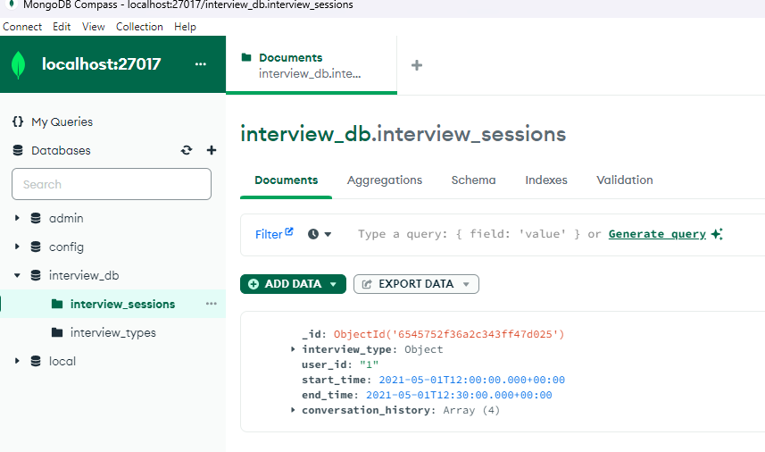

# Database README

- MongoDB is used as the database for this project
- For all the scripts here remember you need you poetry environment activate (e.g. `poetry shell`)

## Connecting and Viewing the Database

- To connect to the database you can either use a GUI (such as MongoDB Compass) or the command line
- I recommend using MongoDB Compass as it is easier to view the data
- Once you've spun up the database using `docker-compose up` you can connect to the database using the following connection string:
  - `mongodb://localhost:27017`
  - This is the default connection string for MongoDB

## Initialising Database

- Once connected you can run `python ./migration/reset.py` to clear the databse and add the default examples found in `./examples`
- Afterwards you should be able to use mongo compass to see the data. An example of this is shown in the image below:
- 

## Clearing Database

- To clear the database you can run `python ./migration/drop_all_collections.py`
- This clears all the collections in the database

## Example Data

This directory contains examples of JSON NoSQL Schema files.
Different files represent 1 or more documents that would go into mongo db collection
The different collections currently are:

- **Interview Types**
  - A collection of documents showing the different interview types as well as other associated metadata

- **Interview Sessions**
  - A collection of documents showing example interview sessions
  - Each interview session stores a copy of the interview type inside it
  - Also stores the conversation history of the interview session
